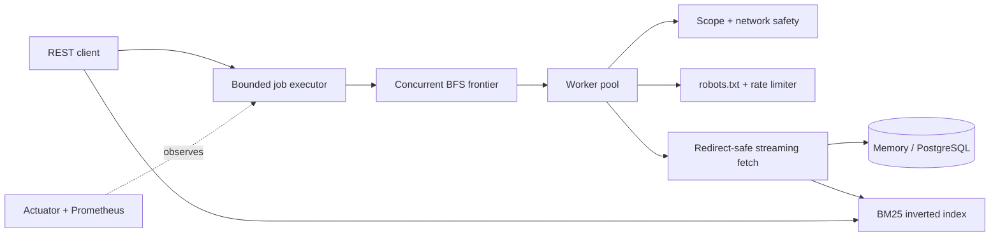

# Concurrent Web Crawler & Search Engine

[](https://github.com/brohum10/concurrent-web-crawler/actions/workflows/ci.yml)
[](https://adoptium.net/)
[](https://spring.io/projects/spring-boot)
[](LICENSE)

A production-minded Java crawler that runs bounded crawl jobs, indexes pages in a BM25 search engine, and exposes progress, cancellation, search, statistics, health, and Prometheus metrics through a Spring Boot API.

## Why this project is interesting

This is more than a recursive link scraper. It focuses on the engineering problems that appear when crawling concurrently:

- **Asynchronous job lifecycle:** queued/running/terminal states, live progress, cancellation, and a bounded job executor
- **Controlled traversal:** thread-safe breadth-first search, maximum page/depth limits, and same-origin, same-host, or unrestricted scope
- **Responsible fetching:** robots.txt caching, per-host delays, bounded retries, non-HTML filtering, and a descriptive user agent
- **Network safety:** private/loopback targets are blocked, redirect destinations are revalidated, credentials are rejected, and response bodies are size-limited while streaming
- **URL quality:** fragments and tracking parameters are removed, default ports and paths are normalized, and duplicates are suppressed atomically
- **Explainable search:** BM25 ranking, title boosting, matched terms, query-aware snippets, top-k selection, and index statistics
- **Operational visibility:** Spring Actuator health/metrics, custom crawl counters/timers, and Prometheus output
- **Persistence choices:** zero-setup in-memory mode or PostgreSQL through Docker Compose

## Quick start

Requirements: Java 17 or newer. The included Gradle wrapper downloads the build tool automatically.

```bash
./gradlew bootRun
```

Start an asynchronous crawl:

```bash
curl -X POST http://localhost:8080/api/v2/crawls \
  -H 'Content-Type: application/json' \
  -d '{
    "seed": "https://example.com",
    "maxPages": 25,
    "maxDepth": 3,
    "scope": "SAME_HOST"
  }'
```

The API returns `202 Accepted` with a job ID. Use it to inspect progress or request cancellation:

```bash
curl http://localhost:8080/api/v2/crawls/crawl_REPLACE_WITH_ID
curl -X DELETE http://localhost:8080/api/v2/crawls/crawl_REPLACE_WITH_ID
```

Search completed pages:

```bash
curl 'http://localhost:8080/api/search?q=distributed+systems&limit=10'
```

The original blocking `POST /api/crawl` route remains available for simple scripts. For persistent storage, run `docker compose up --build` instead of `bootRun`.

## System design



See [docs/architecture.md](docs/architecture.md) for the concurrency model, state transitions, safety boundaries, and scaling tradeoffs. A machine-readable contract is available in [docs/openapi.yaml](docs/openapi.yaml).

## API

| Method | Route | Purpose |
|---|---|---|
| `POST` | `/api/v2/crawls` | Queue a crawl and return its job state |
| `GET` | `/api/v2/crawls` | List crawl jobs, newest first |
| `GET` | `/api/v2/crawls/{id}` | Read live progress and the final report |
| `DELETE` | `/api/v2/crawls/{id}` | Cooperatively cancel queued or running work |
| `POST` | `/api/crawl` | Run a crawl synchronously for backward compatibility |
| `GET` | `/api/search?q=...&limit=...` | Return ranked BM25 results with matched terms |
| `GET` | `/api/stats` | Return index statistics and job counts |
| `GET` | `/api/health` | Return lightweight application status |
| `GET` | `/actuator/health` | Spring Boot readiness/health information |
| `GET` | `/actuator/prometheus` | Prometheus-formatted JVM, HTTP, and crawler metrics |

`scope` accepts `SAME_ORIGIN`, `SAME_HOST` (default), or `ANY`. `maxDepth` defaults to 4, and the server-wide maximum page limit defaults to 500.

## Configuration

Spring properties can be overridden in `application.yml`, through environment variables, or with command-line arguments.

| Property | Default | Purpose |
|---|---:|---|
| `crawler.workers` | `8` | Fetch workers inside each active crawl |
| `crawler.max-pages` | `500` | Server-enforced per-job page ceiling |
| `crawler.max-concurrent-jobs` | `2` | Crawls allowed to run simultaneously |
| `crawler.max-queued-jobs` | `50` | Waiting jobs accepted before the API returns `429` |
| `crawler.per-host-delay` | `250ms` | Minimum spacing between requests to one host |
| `crawler.request-timeout` | `8s` | Connect and request timeout |
| `crawler.max-retries` | `2` | Retry count with bounded exponential backoff |
| `crawler.max-response-bytes` | `2000000` | Maximum HTML response size read into memory |

## Verification

```bash
./gradlew clean test bootJar
```

The deterministic suite covers cycles and concurrent duplicate suppression, depth/scope/cancellation behavior, URL normalization, redirect and body-size handling, robots rules, BM25 ranking, metadata/snippets, index statistics, persistence boundaries, and application startup.

Run the deterministic search benchmark:

```bash
./gradlew benchmark --args='25000 1000'
```

Latest local run on an arm64 Mac (September 1, 2026):

| Documents | Queries | Recall@10 | p50 | p95 |
|---:|---:|---:|---:|---:|
| 25,000 | 1,000 | 1.000 | 18.294 ms | 20.503 ms |

These numbers measure the in-memory search benchmark, not network crawling. Crawl throughput is intentionally constrained by politeness settings and real network latency.

## Responsible use

Only crawl sites you are allowed to access. The built-in controls reduce accidental load and common server-side request forgery risks, but they do not replace site-specific terms, legal review, authentication controls, or production network isolation.

## License

MIT
