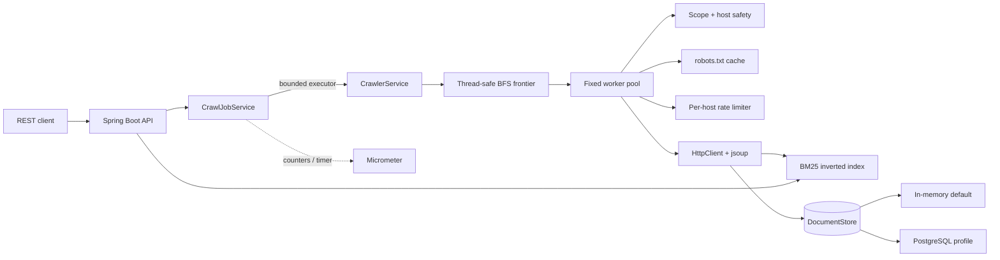
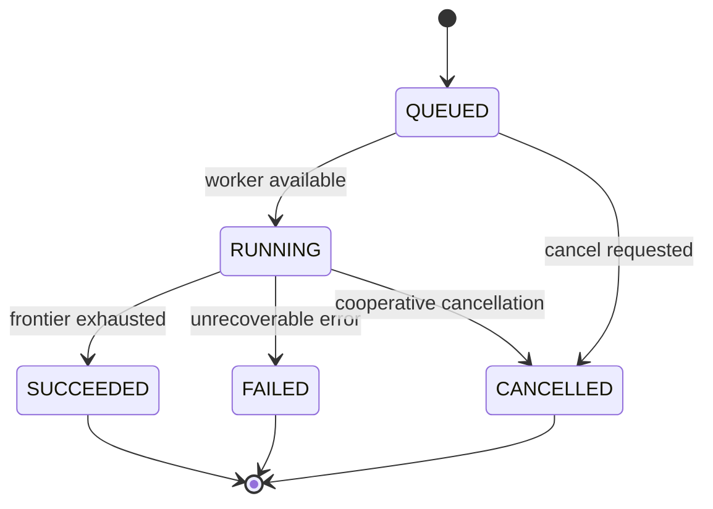

# Architecture

The application separates job orchestration, crawling, fetching, indexing, and persistence so each boundary can be tested independently.

## Crawl job state machine

Job snapshots are immutable API values. The mutable internal job state uses volatile fields for visibility and synchronized terminal transitions. A fixed-size executor limits simultaneous crawls; every crawl has its own fixed worker pool.

## Concurrency model

- The frontier is a `LinkedBlockingQueue` of `(URL, depth)` tasks.
- A concurrent set atomically accepts each canonical URL once, preventing duplicate work across cycles and competing workers.
- An atomic outstanding-work counter includes queued and in-flight tasks. Workers stop only when that counter reaches zero.
- The page reservation counter enforces `maxPages` even when multiple workers discover links at the same time.
- Progress is assembled from atomic counters and published after each completed task.
- Cancellation is cooperative: queued tasks are drained without fetching, while an in-flight request is allowed to finish or time out safely.

## Traversal controls

Each job defines three independent boundaries:

1. `maxPages` caps the number of unique URLs reserved for the job.
2. `maxDepth` caps BFS distance from the seed; zero fetches only the seed.
3. `scope` selects same origin, same host, or any safe public host.

Known non-HTML extensions are filtered before a request. Content-Type is checked again after the response because extensions are only a hint.

## Fetch and network safety

The API accepts user-supplied destinations, so the fetch path treats every hop as untrusted:

- Only absolute HTTP(S) URLs without embedded credentials are accepted.
- DNS results that resolve to loopback, link-local, site-local/private, multicast, or unspecified addresses are blocked.
- Automatic redirects are disabled. Up to five redirect hops are followed manually, canonicalized, and passed through the host safety policy again.
- Response bodies are streamed and stopped at the configured byte ceiling before jsoup parsing.
- Only HTML/XHTML is indexed.
- robots.txt rules are cached per origin; a host-scoped rate limiter spaces requests; retry count and backoff are bounded.

DNS rebinding is still best handled with infrastructure-level egress rules because Java's high-level `HttpClient` does not expose connection-time address pinning.

## Search and persistence

The in-process inverted index uses BM25. Title terms receive a 3x frequency boost, and query evaluation uses a bounded min-heap so memory for top-k selection is `O(k)`. Results include matched terms and a query-centered snippet to make ranking easier to inspect.

`DocumentStore` has two implementations:

- `InMemoryDocumentStore` for a zero-setup local run
- `JdbcDocumentStore` for the `postgres` Spring profile

When the application starts, persisted documents are replayed into the index. Re-indexing the same canonical URL replaces the existing document rather than creating a duplicate.

## Complexity

For `V` accepted pages and `E` discovered links, frontier traversal is `O(V + E)` excluding network and parsing costs. URL membership checks are expected `O(1)`. For a query, BM25 work is proportional to the postings visited for its unique terms, and top-k maintenance adds `O(log k)` for each scored document.

## Scaling path

For a multi-instance deployment, the in-memory job registry and frontier should move to durable shared infrastructure, host politeness should be coordinated globally, and the search index should move to a partitioned engine. The current interfaces keep those replacements localized rather than mixing them into controller or parsing code.
