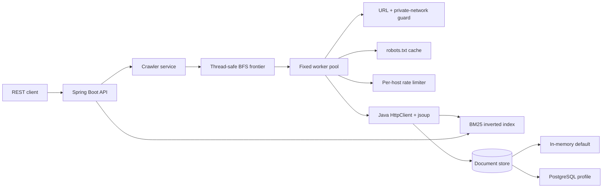

# Architecture

The project separates crawling, indexing, persistence, and HTTP concerns so each part can be tested independently.

## Key decisions

- **Bounded concurrency:** a fixed pool prevents unbounded thread creation. An atomic outstanding-work counter lets workers exit only when the frontier and all in-flight pages are complete.
- **Duplicate prevention:** URLs are normalized before a concurrent scheduled set accepts them, so cycles and repeated links are fetched once.
- **Responsible crawling:** robots.txt rules are cached per origin and requests are spaced per host. Retries use bounded exponential backoff.
- **Network safety:** the HTTP API rejects localhost, link-local, and private-network targets to reduce server-side request forgery risk.
- **Search:** the in-process inverted index uses BM25 and a bounded priority queue for top-k selection. PostgreSQL stores crawled documents so the index can be rebuilt at startup.
- **Replaceable boundaries:** `PageFetcher`, `RobotsPolicy`, and `DocumentStore` are interfaces, making deterministic tests possible without network access.

## Production extensions

For a larger deployment, the frontier can move to a durable queue, the index can be sharded, and crawl jobs can run asynchronously behind a job API. DNS should be revalidated at connection time to harden against rebinding, and content-size limits should also be enforced while streaming responses.
